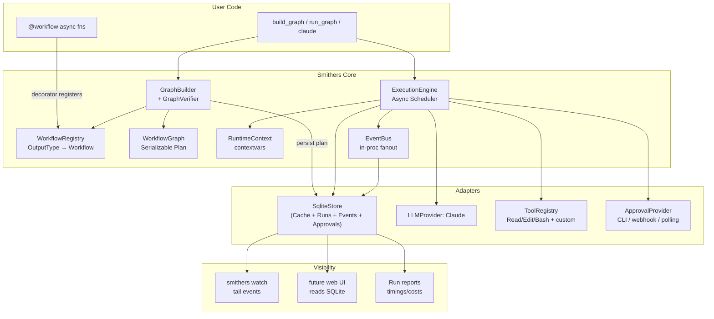
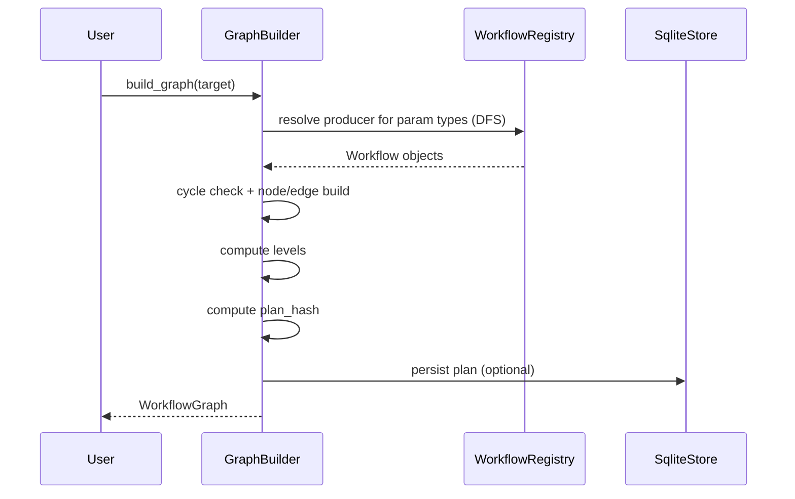
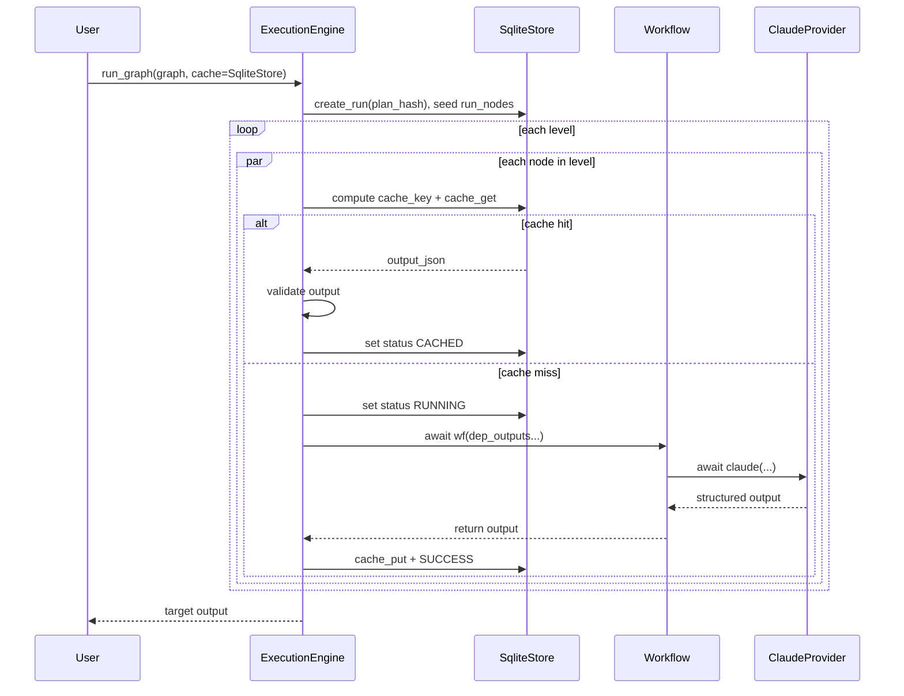
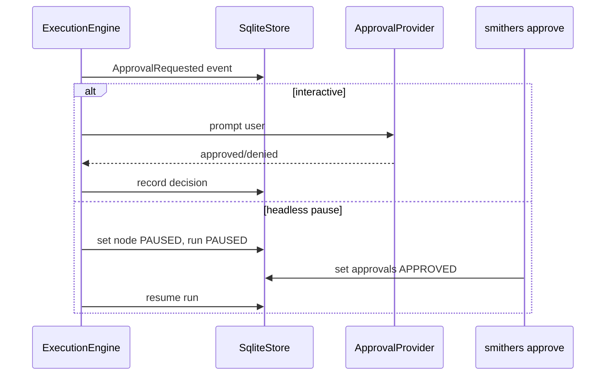
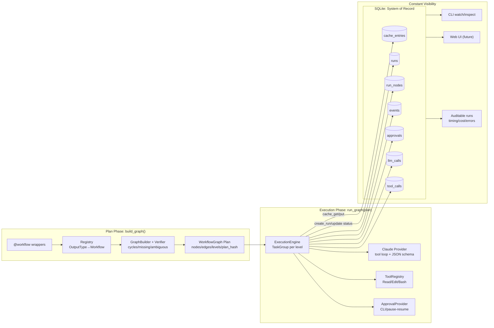

# Smithers Architecture

This design is optimized around three non-negotiables:

1. **Plan before execute** — `build_graph()` is the plan. Execution only consumes a frozen plan.
2. **SQLite as the system of record** — all state (plan, runs, node status, cache, events, approvals, LLM/tool transcripts) lives in SQLite.
3. **Verification + constant visibility drive everything** — every step is validated, hashed, logged, and queryable in near-real time.

---

## 1. Goals, Requirements, and Invariants

### Primary Goals

- **Deterministic planning**: `build_graph(target)` produces a **WorkflowGraph Plan** that is stable and serializable.
- **Correct dependency resolution**: dependencies are derived from type hints with explicit, debuggable rules.
- **Verifiable execution**:
  - Every workflow output is validated against its declared type.
  - Every cache hit is validated (schema + hash).
  - Every tool call input/output is validated.
  - Every state transition is persisted to SQLite.
- **Visibility by default**: a separate process (CLI "watch", future web UI) can show progress by querying SQLite without needing in-process hooks.
- **Testability**: workflows can be called directly, graphs can be tested without execution, and `claude()` can be mocked/replayed deterministically.

### Explicit Non-Goals (v1)

- Distributed execution across machines.
- Multi-writer remote DB with concurrency beyond SQLite best practices.
- Automatic module scanning "magic" across arbitrary imports (unless explicitly opted in).

### System Invariants (Verification Backbone)

These are enforced by code and assertable in tests:

- **I1**: A `WorkflowGraph` must be a DAG (cycle detection at plan time).
- **I2**: Each node's declared `output_type` must be validated at runtime (Pydantic `TypeAdapter`).
- **I3**: Every node run is content-addressed: `node_cache_key = H(workflow_identity + workflow_code_hash + input_hash + runtime_hash)`.
- **I4**: Every node state transition is persisted to SQLite (append-only events + current-state tables).
- **I5**: Cache entries must be schema-valid and hash-consistent or treated as corrupt/miss.
- **I6**: Approval is an explicit persisted gate; execution can pause and resume from SQLite.

---

## 2. Architecture Overview

### System Diagram (Plan → Execute → Observe)



**Design choice**: SQLite is not "just a cache." It's the **execution ledger** + cache + event log. This enables constant visibility and the "LLM can monitor / human can patch state" workflow.

---

## 3. Module Structure

```text
smithers/
  __init__.py                 # exports: workflow, require_approval, build_graph, run_graph, claude, SqliteCache
  core/
    types.py                  # shared type aliases, enums
    errors.py                 # structured exceptions
    workflow.py               # Workflow wrapper + @workflow decorator
    registry.py               # WorkflowRegistry
    graph.py                  # WorkflowGraph data structures + serialization
    builder.py                # build_graph + cycle detection + levelization
    executor.py               # run_graph + scheduler + dependency plumbing
    runtime.py                # RuntimeContext via contextvars, dependency injection
    events.py                 # Event models + sinks
    hashing.py                # canonical JSON + hashing primitives
    verification.py           # graph invariants + cache integrity checks
  llm/
    provider.py               # LLMProvider protocol
    claude.py                 # Claude implementation (tool loop, structured output)
    prompts.py                # prompt formatting, JSON schema helpers
  tools/
    base.py                   # Tool protocol + pydantic IO adapters
    registry.py               # ToolRegistry (names → Tool)
    builtins/
      read.py
      edit.py
      bash.py
  store/
    sqlite.py                 # SqliteStore impl (tables, queries, transactions)
    migrations.py             # schema init + migrations
  approvals/
    base.py                   # ApprovalProvider protocol
    cli.py                    # CLI implementation
  testing/
    fakes.py                  # FakeLLMProvider, FakeTools
    replay.py                 # record/replay from SQLite for deterministic tests
    helpers.py                # test utilities
  cli/
    main.py                   # smithers CLI entry
    commands/
      run.py
      graph.py
      watch.py
      approve.py
      inspect.py
```

---

## 4. Core Data Structures

### 4.1 Shared Types and Enums

```python
# smithers/core/types.py
from __future__ import annotations

from dataclasses import dataclass
from enum import Enum
from typing import Any, NewType, TypeAlias

RunId = NewType("RunId", str)
NodeId = NewType("NodeId", str)
WorkflowId = NewType("WorkflowId", str)
CacheKey = NewType("CacheKey", str)

JsonValue: TypeAlias = Any  # must be JSON-serializable at persistence boundary

class NodeStatus(str, Enum):
    PENDING = "PENDING"
    READY = "READY"
    RUNNING = "RUNNING"
    CACHED = "CACHED"
    SUCCESS = "SUCCESS"
    SKIPPED = "SKIPPED"
    FAILED = "FAILED"
    CANCELLED = "CANCELLED"
    PAUSED = "PAUSED"

class RunStatus(str, Enum):
    PLANNED = "PLANNED"
    RUNNING = "RUNNING"
    SUCCESS = "SUCCESS"
    FAILED = "FAILED"
    CANCELLED = "CANCELLED"
    PAUSED = "PAUSED"

@dataclass(frozen=True)
class RetryPolicy:
    max_attempts: int = 1
    backoff_seconds: float = 0.0
    backoff_multiplier: float = 1.0
    retry_on: tuple[type[BaseException], ...] = ()
```

### 4.2 Workflow Metadata and Wrapper

```python
# smithers/core/workflow.py
from __future__ import annotations

import inspect
from dataclasses import dataclass
from typing import Awaitable, Callable, Generic, ParamSpec, TypeVar, get_type_hints

from pydantic import TypeAdapter

from .types import WorkflowId, RetryPolicy

P = ParamSpec("P")
R = TypeVar("R")

@dataclass(frozen=True)
class WorkflowParam:
    name: str
    annotation: object  # original type hint
    adapter: TypeAdapter  # runtime validator/serializer

@dataclass(frozen=True)
class WorkflowMeta:
    id: WorkflowId
    name: str                   # human name (qualname)
    module: str
    qualname: str
    doc: str | None
    is_async: bool
    params: tuple[WorkflowParam, ...]
    return_annotation: object
    return_adapter: TypeAdapter
    code_hash: str              # source/code digest
    retry: RetryPolicy
    requires_approval: bool
    approval_prompt: str | None
    cacheable: bool

class Workflow(Generic[P, R]):
    """
    Callable wrapper around the user function.
    - Preserves direct callability for unit tests.
    - Carries metadata for graph building & caching.
    """
    __slots__ = ("fn", "meta")

    def __init__(self, fn: Callable[P, Awaitable[R]], meta: WorkflowMeta) -> None:
        self.fn = fn
        self.meta = meta

    def __call__(self, *args: P.args, **kwargs: P.kwargs) -> Awaitable[R]:
        return self.fn(*args, **kwargs)

    def signature(self) -> inspect.Signature:
        return inspect.signature(self.fn)
```

### 4.3 Registry

```python
# smithers/core/registry.py
from __future__ import annotations

from dataclasses import dataclass, field
from typing import Any

from .workflow import Workflow
from .errors import DuplicateProducerError, MissingProducerError

@dataclass
class WorkflowRegistry:
    # Main lookup: "what produces type T?"
    by_output: dict[object, Workflow[Any, Any]] = field(default_factory=dict)

    # Secondary: stable identity
    by_id: dict[str, Workflow[Any, Any]] = field(default_factory=dict)

    def register(self, wf: Workflow[Any, Any]) -> None:
        out = wf.meta.return_annotation
        if out in self.by_output:
            raise DuplicateProducerError(out, self.by_output[out], wf)
        self.by_output[out] = wf
        self.by_id[str(wf.meta.id)] = wf

    def producer_for(self, annotation: object) -> Workflow[Any, Any]:
        if annotation not in self.by_output:
            raise MissingProducerError(annotation)
        return self.by_output[annotation]
```

### 4.4 Graph Plan Types

```python
# smithers/core/graph.py
from __future__ import annotations

from dataclasses import dataclass
from typing import Literal

from .types import NodeId, WorkflowId

@dataclass(frozen=True)
class DepBinding:
    """How a workflow parameter gets its value."""
    kind: Literal["node_output", "external_input", "injected"]
    param: str
    from_node: NodeId | None = None
    input_key: str | None = None
    injected_type: str | None = None

@dataclass(frozen=True)
class GraphNode:
    node_id: NodeId
    workflow_id: WorkflowId
    workflow_name: str
    module: str
    qualname: str
    code_hash: str

    return_type_repr: str
    param_bindings: tuple[DepBinding, ...]
    deps: tuple[NodeId, ...]

    cacheable: bool
    requires_approval: bool
    approval_prompt: str | None

@dataclass(frozen=True)
class WorkflowGraph:
    """Frozen execution plan. Serializable + hashable."""
    target: NodeId
    nodes: dict[NodeId, GraphNode]
    edges: dict[NodeId, tuple[NodeId, ...]]
    levels: tuple[tuple[NodeId, ...], ...]
    plan_hash: str

    def mermaid(self) -> str:
        lines = ["graph LR"]
        for from_node, to_nodes in self.edges.items():
            for to_node in to_nodes:
                lines.append(f"    {from_node} --> {to_node}")
        return "\n".join(lines)
```

---

## 5. The `@workflow` Decorator

### Responsibilities

1. Wrap the async function in a `Workflow` object (callable).
2. Extract and freeze introspection metadata:
   - input param annotations (dependencies)
   - return annotation (product/output type)
3. Create Pydantic `TypeAdapter`s for params and return type for:
   - runtime validation
   - canonical JSON dumping for hashing/caching
4. Compute a **workflow code hash** for cache invalidation.
5. Register the workflow into a **registry**.

### What it returns

A `Workflow[P, R]` instance (callable wrapper), **not** the raw function.

After decoration:
- `type(analyze)` is `Workflow`
- `await analyze()` still works (direct call)
- Dependencies are introspected from `analyze.meta.params`
- Output type is in `analyze.meta.return_annotation`

---

## 6. Workflow Registry & Discovery

### The Core Resolution Rule

Given a workflow parameter annotation, `build_graph` resolves it:

- **Exact match**: `analysis: AnalysisOutput` requires a producer with return annotation exactly `AnalysisOutput`.
- **Optional normalization**: if param is `AnalysisOutput | None`, normalize to `AnalysisOutput` for producer resolution.
- **Injected params**: if param annotation is `RunContext` (or other internal types), treat as injected (not a dependency edge).

### Error Cases

- **Multiple workflows produce same type**: Hard error at registration time (`DuplicateProducerError`).
- **No workflow produces required type**: Plan-time error (`MissingProducerError`).
- **Circular dependency**: Plan-time error (`CycleError`).

---

## 7. The `build_graph` Algorithm

### Phases

1. **Resolve dependencies** recursively starting from target.
2. **Construct nodes and edges** (DAG).
3. **Verify invariants** (cycles, missing deps).
4. **Compute levels** (parallel strata via Kahn's algorithm).
5. **Freeze + hash plan**.

### Pseudocode

```python
def build_graph(target_workflow: Workflow, registry: WorkflowRegistry) -> WorkflowGraph:
    nodes: dict[NodeId, GraphNode] = {}
    edges: dict[NodeId, set[NodeId]] = {}
    visiting: set[NodeId] = set()  # DFS recursion stack
    visited: set[NodeId] = set()

    def dfs(wf: Workflow) -> NodeId:
        nid = NodeId(str(wf.meta.id))
        if nid in visiting:
            raise CycleError(...)
        if nid in visited:
            return nid

        visiting.add(nid)
        deps = []

        for p in wf.meta.params:
            if is_injected(p.annotation):
                continue
            producer = registry.producer_for(p.annotation)
            dep_id = dfs(producer)
            deps.append(dep_id)
            edges.setdefault(dep_id, set()).add(nid)

        nodes[nid] = GraphNode(...)
        visiting.remove(nid)
        visited.add(nid)
        return nid

    target_id = dfs(target_workflow)
    levels = compute_levels(nodes, edges)
    plan_hash = hash_canonical_json(serialize_graph(...))

    return WorkflowGraph(target=target_id, nodes=nodes, edges=edges, levels=levels, plan_hash=plan_hash)
```

---

## 8. The `run_graph` Execution Engine

### Execution Model

- Consume a frozen `WorkflowGraph`.
- Create a **Run** row in SQLite with `plan_hash`.
- Create **RunNode** rows for each node.
- Execute levels in order, with nodes in each level running concurrently via `asyncio.TaskGroup`.
- For each node:
  - Compute cache key
  - Attempt cache read
  - On miss: execute workflow function with validated inputs
  - Validate output and persist
  - Emit events to SQLite throughout

### Error Handling

Default policy (fail-fast):
- If any node in a level fails, cancel remaining nodes and all downstream nodes.
- Persist which nodes were cancelled and failure root cause.
- Raise `RunFailed` with structured details.

---

## 9. The `claude()` Function

### Responsibilities

- Prepare a model request (prompt, system rules, tool specs).
- Run a **tool-using loop**:
  - LLM responds with either final answer or tool invocations
  - Runtime executes tools, records results, feeds back to LLM
- Validate final output using Pydantic v2.
- Emit structured events to SQLite for visibility.

### Structured Output Enforcement

- Always provide the output schema in the prompt (JSON Schema via Pydantic).
- Parse final message as JSON and validate with `TypeAdapter(output_type)`.
- On validation failure: emit event, optionally run repair attempts.

---

## 10. Tools System

### Tool Registry

- `tools=["Read", "Edit", "Bash"]` are names resolved through `ToolRegistry`.
- Each tool has:
  - Input schema (Pydantic model)
  - Output schema (Pydantic model or raw text)
  - Async function implementation

### Tool Protocol

```python
class Tool(Protocol):
    name: str
    input_model: Type[BaseModel]
    output_model: Type[BaseModel] | None

    async def run(self, *, ctx: ToolContext, args: BaseModel) -> BaseModel | str: ...
```

---

## 11. Caching System

### What is Hashed?

Cache key = `H(workflow_id + code_hash + input_hash + runtime_hash)`

- **Workflow identity**: `module:qualname`
- **Code hash**: digest of source/bytecode
- **Input hash**: canonical JSON of dependency outputs
- **Runtime hash**: smithers version, LLM model name

### SQLite Schema

```sql
-- cache entries: content-addressed results
create table if not exists cache_entries (
  cache_key text primary key,
  workflow_id text not null,
  code_hash text not null,
  input_hash text not null,
  runtime_hash text not null,
  output_json text not null,
  output_hash text not null,
  created_at text not null,
  last_accessed_at text not null
);

-- runs: each plan execution
create table if not exists runs (
  run_id text primary key,
  plan_hash text not null,
  target_node_id text not null,
  status text not null,
  created_at text not null,
  finished_at text
);

-- run_nodes: current status per node within a run
create table if not exists run_nodes (
  run_id text not null,
  node_id text not null,
  workflow_id text not null,
  status text not null,
  started_at text,
  finished_at text,
  cache_key text,
  output_hash text,
  skip_reason text,
  error_json text,
  primary key (run_id, node_id)
);

-- events: append-only log for constant visibility
create table if not exists events (
  event_id integer primary key autoincrement,
  run_id text not null,
  node_id text,
  ts text not null,
  type text not null,
  payload_json text not null
);

-- approvals: gates
create table if not exists approvals (
  run_id text not null,
  node_id text not null,
  prompt text not null,
  status text not null,
  decided_by text,
  decided_at text,
  primary key (run_id, node_id)
);

-- llm_calls: tracking for visibility + cost
create table if not exists llm_calls (
  call_id integer primary key autoincrement,
  run_id text not null,
  node_id text not null,
  ts_start text not null,
  ts_end text,
  model text not null,
  input_tokens integer,
  output_tokens integer,
  cost_usd real,
  request_json text,
  response_json text
);

-- tool_calls: tracking
create table if not exists tool_calls (
  tool_call_id integer primary key autoincrement,
  run_id text not null,
  node_id text not null,
  ts_start text not null,
  ts_end text,
  tool_name text not null,
  input_json text not null,
  output_json text,
  status text not null,
  error_json text
);
```

---

## 12. Human-in-the-Loop

### `@require_approval` Decorator

Attaches metadata to the function:
- `requires_approval = True`
- `approval_prompt = "message"`

### Pause/Resume Model

**Mode A: Interactive (CLI)**
- When node is reached, prompt user in-process.
- Decision written to `approvals` table.

**Mode B: Pausable/Resumable (Headless)**
- Record approval request in SQLite.
- Mark node `PAUSED`, run `PAUSED`.
- Later: `smithers approve --run RUN --node NODE --yes`
- Then: `smithers resume --run RUN`

---

## 13. Observability & Progress

### Event-First Observability

Everything emits events persisted to SQLite immediately:

- `RunStarted`, `RunFinished`, `RunFailed`, `RunPaused`
- `NodeReady`, `NodeStarted`, `NodeFinished`, `NodeFailed`, `NodeSkipped`, `NodeCached`
- `CacheHit`, `CacheMiss`, `CacheCorrupt`
- `ApprovalRequested`, `ApprovalDecided`
- `LLMCallStarted`, `LLMCallFinished`
- `ToolCallStarted`, `ToolCallFinished`

### CLI Commands

- `smithers watch ./cache.db --run <id>` — tail events live
- `smithers inspect ./cache.db --run <id>` — print node table

---

## 14. Testing

### A. Unit Test Workflows Directly

```python
async def test_implement_unit():
    analysis = AnalysisOutput(files=["a.py"], summary="x")
    out = await implement(analysis)
    assert "a.py" in out.changed_files
```

### B. Graph-Only Tests

```python
def test_graph_shape():
    g = build_graph(deploy)
    assert [len(level) for level in g.levels] == [1, 2, 1]
```

### C. Mock `claude()`

```python
from smithers.testing import FakeLLMProvider, use_runtime

async def test_analyze_with_fake_llm():
    fake = FakeLLMProvider(responses=[{"files": ["x.py"], "summary": "ok"}])
    async with use_runtime(llm=fake):
        out = await analyze()
        assert out.files == ["x.py"]
```

### D. Record/Replay

- First run (record): real Claude + tools, store transcripts in SQLite.
- Replay mode: executor reads transcripts and replays outputs without network.

---

## 15. Sequence Diagrams

### Build Plan



### Execute with Caching



### Approval Gate



---

## 16. Full System Diagram


